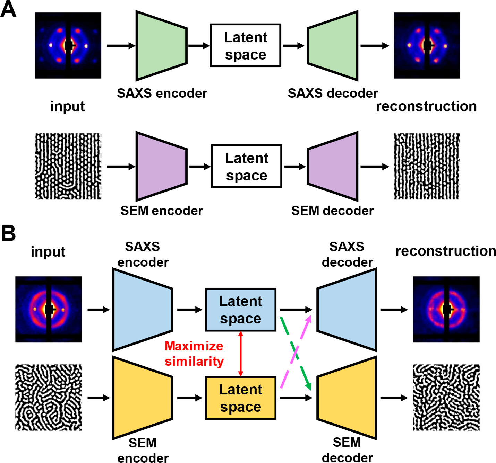

Configuration guide
===================

.. note::
   This guide explains how to configure AutoFill training experiments, including all available parameters and what to expect from the training outputs.

.. contents::
   :local:
   :depth: 2

Configuration file structure
----------------------------

.. note::
   AutoFill uses YAML configuration files to define experiments. Here's the complete structure with all available parameters:

Basic structure
~~~~~~~~~~~~~~~

.. code-block:: yaml

   # Required: Experiment identification
   experiment_name: "my_experiment"
   run_name: "run_001"

   # Optional: MLFlow tracking (if not provided, uses TensorBoard)
   mlflow_uri: "http://localhost:5000"

   # Required: Model configuration
   model:
     type: "vae"  # or "pair_vae"
     # Model-specific parameters...

   # Required: Dataset configuration
   dataset:
     h5_file_path: "data/all_data.h5"
     # Dataset-specific parameters...

   # Required: Training configuration
   training:
     num_epochs: 100
     # Training-specific parameters...

   # Optional: Data transformations
   transforms_data:
     q: []  # Q-axis transformations
     y: []  # Signal transformations

Required parameters
~~~~~~~~~~~~~~~~~~~

**Top-level required parameters:**

``experiment_name`` (string)
    Name of the experiment. Used for organizing logs and outputs.

``run_name`` (string)
    Unique identifier for this specific run within the experiment.

``model`` (dict)
    Model configuration dictionary (see model configuration section).

``dataset`` (dict)
    Dataset configuration dictionary (see dataset configuration section).

``training`` (dict)
    Training configuration dictionary (see training configuration section).

Model configuration
-------------------

VAE model (single modality)
~~~~~~~~~~~~~~~~~~~~~~~~~~~

.. code-block:: yaml

   model:
     type: "vae"
     latent_dim: 128
     encoder_layers: [512, 256, 128]
     decoder_layers: [128, 256, 512]
     activation: "relu"
     dropout: 0.1
     beta: 1.0  # KL divergence weight

**VAE parameters:**

``type`` (string, required)
    Must be ``"vae"`` for single-modality variational autoencoder.

    .. note::
       This parameter can be overridden using the ``--mode`` command-line argument when running ``03_train.py``. This allows you to switch between VAE and PairVAE models using the same configuration file by specifying ``--mode vae`` or ``--mode pair_vae``.

``latent_dim`` (int, default: 128)
    Dimensionality of the latent space.

``encoder_layers`` (list, default: [512, 256, 128])
    Layer sizes for the encoder network.

``decoder_layers`` (list, default: [128, 256, 512])
    Layer sizes for the decoder network.

``activation`` (string, default: "relu")
    Activation function. Options: ``"relu"``, ``"tanh"``, ``"sigmoid"``, ``"leaky_relu"``.

``dropout`` (float, default: 0.1)
    Dropout rate for regularization.

``beta`` (float, default: 1.0)
    Beta parameter for β-VAE. Controls the weight of KL divergence term.

PairVAE model (multi-modality)
~~~~~~~~~~~~~~~~~~~~~~~~~~~~~~

The PairVAE architecture is based on the methodology described in Lu and Jayaraman [1]_,
which enables linking and cross-reconstruction between complementary structural
characterization techniques like SAXS and LES.

The PairVAE consists of:

- **Dual encoders**: Separate encoders for each modality (SAXS and LES) that map input data to a shared latent space
- **Dual decoders**: Modality-specific decoders that reconstruct data within the same domain
- **Cross-modal decoders**: Additional decoders that enable translation between modalities (SAXS↔LES)
- **Shared latent space**: A common representation that captures the underlying physical properties

This architecture allows for:

1. **Intra-modal reconstruction**: Reconstructing SAXS from SAXS latent representation
2. **Cross-modal translation**: Converting LES data to SAXS format and vice versa
3. **Data completion**: Filling missing measurements from one technique using data from another

.. code-block:: yaml

   model:
     type: "pair_vae"
     latent_dim: 128
     # Encoder configurations
     encoder_saxs_layers: [512, 256, 128]
     encoder_les_layers: [512, 256, 128]
     # Decoder configurations
     decoder_saxs_layers: [128, 256, 512]
     decoder_les_layers: [128, 256, 512]
     # Cross-modal decoders
     cross_decoder_saxs_layers: [128, 256, 512]
     cross_decoder_les_layers: [128, 256, 512]
     activation: "relu"
     dropout: 0.1
     beta: 1.0

**PairVAE parameters:**

``type`` (string, required)
    Must be ``"pair_vae"`` for paired modality variational autoencoder.

``encoder_saxs_layers``, ``encoder_les_layers`` (list)
    Layer sizes for SAXS and LES encoders respectively.

``decoder_saxs_layers``, ``decoder_les_layers`` (list)
    Layer sizes for SAXS and LES decoders respectively.

``cross_decoder_saxs_layers``, ``cross_decoder_les_layers`` (list)
    Layer sizes for cross-modal decoders (LES→SAXS and SAXS→LES).

Dataset configuration
---------------------

Single modality dataset
~~~~~~~~~~~~~~~~~~~~~~~

.. code-block:: yaml

   dataset:
     h5_file_path: "data/all_data.h5"
     requested_metadata: ["diameter_nm", "concentration_original", "material"]
     exclude_columns: ["bad_column"]
     max_length: 1000
     min_length: 50

**Dataset parameters:**

``h5_file_path`` (string, required)
    Path to the HDF5 file containing the preprocessed data.

    .. note::
       This parameter can be overridden using the ``--hdf5_file`` command-line argument when running ``03_train.py``. This allows you to use the same configuration file with different datasets without modifying the YAML file.

``requested_metadata`` (list, optional)
    List of metadata columns to include. If not specified, includes all available metadata.

``exclude_columns`` (list, optional)
    List of column names to exclude from the dataset.

``max_length`` (int, optional)
    Maximum length for time series padding/truncation.

``min_length`` (int, optional)
    Minimum length required for time series inclusion.

Paired modality dataset
~~~~~~~~~~~~~~~~~~~~~~~

.. code-block:: yaml

   dataset:
     h5_file_path: "data/pair_all_data.h5"
     requested_metadata: ["diameter_nm", "concentration_original"]
     max_length_saxs: 1000
     max_length_les: 800
     min_length_saxs: 50
     min_length_les: 30

**Additional PairVAE parameters:**

``max_length_saxs``, ``max_length_les`` (int)
    Maximum lengths for SAXS and LES modalities respectively.

``min_length_saxs``, ``min_length_les`` (int)
    Minimum lengths for SAXS and LES modalities respectively.

Training configuration
----------------------

Basic training parameters
~~~~~~~~~~~~~~~~~~~~~~~~~

.. code-block:: yaml

   training:
     # Required
     num_epochs: 100
     array_train_indices: "data/train_indices.npy"
     array_val_indices: "data/val_indices.npy"

     # Optional
     array_test_indices: "data/val_indices.npy"

     # Optional with defaults
     batch_size: 32
     num_workers: 4
     patience: 20
     min_delta: 0.0001
     save_every: 1

     # Compute resources
     num_gpus: 1
     num_nodes: 1

     # Output and logging
     output_dir: "train_results"
     use_loglog: true
     plot_train: true
     every_n_epochs: 10
     num_samples: 10

**Training parameters:**

``num_epochs`` (int, required)
    Maximum number of training epochs.

``array_train_indices``, ``array_val_indices`` (string, required)
    Paths to NumPy files containing train/validation split indices. 
    If None, the HDF5 file will be split 80%/20%. Using data already used in training VAE to train PairVAE may therefore lead to Data Leak.

``array_test_indices`` (string, optional)
    Path to NumPy file containing test split indices. If None, no test set is used.

``batch_size`` (int, default: 32)
    Training batch size.

``num_workers`` (int, default: 4)
    Number of data loading workers.

``patience`` (int, default: num_epochs // 5)
    Early stopping patience (epochs without improvement).

``min_delta`` (float, default: 0.0001)
    Minimum change for early stopping criterion.

``save_every`` (int, default: 1)
    Save checkpoint every N epochs.

``num_gpus`` (int, default: 1)
    Number of GPUs to use for training.

``num_nodes`` (int, default: 1)
    Number of compute nodes (for distributed training).

``output_dir`` (string, default: "train_results")
    Base directory for saving training outputs.

``use_loglog`` (bool, default: true)
    Use log-log scale for validation plots.

``plot_train`` (bool, default: true)
    Generate training plots during validation.

``every_n_epochs`` (int, default: 10)
    Generate inference plots every N epochs.

``num_samples`` (int, default: 10)
    Number of samples to use for inference plots.

Data transformations
--------------------

Transform pipeline
~~~~~~~~~~~~~~~~~~~

.. code-block:: yaml

   transforms_data:
     q:
       - type: "log10"
       - type: "normalize"
         method: "minmax"
     y:
       - type: "log10"
       - type: "clip"
         min_val: 1e-10
         max_val: 1e10
       - type: "normalize"
         method: "standard"

**Available transformations:**

``log10``
    Apply base-10 logarithm transformation.

``normalize``
    Normalize data. Methods: ``"minmax"``, ``"standard"``, ``"robust"``.

``clip``
    Clip values to specified range with ``min_val`` and ``max_val``.

``pad``
    Pad sequences to specified ``length``.

``truncate``
    Truncate sequences to specified ``max_length``.

Logging configuration
---------------------

MLFlow logging
~~~~~~~~~~~~~~

.. code-block:: yaml

   # Enable MLFlow logging
   mlflow_uri: "http://localhost:5000"
   experiment_name: "saxs_experiments"
   run_name: "baseline_run"

.. note::
    To use MLFlow for experiment tracking, provide the ``mlflow_uri`` parameter with the address of your MLFlow server.
    Check MlFlow docs for setup instructions: https://mlflow.org/docs/3.1.3/ml/tracking/server/

When ``mlflow_uri`` is provided, AutoFill will:

- Log all hyperparameters and metrics to MLFlow
- Upload model artifacts and plots
- Track experiment lineage
- Enable MLFlow UI for visualization

TensorBoard logging (default)
~~~~~~~~~~~~~~~~~~~~~~~~~~~~~

When ``mlflow_uri`` is **not** provided, AutoFill automatically uses TensorBoard:

- Logs are saved to ``{output_dir}/{experiment_name}/{run_name}/``
- Hyperparameters, metrics, and scalars are logged
- View logs with: ``tensorboard --logdir=train_results``

Example configurations
----------------------

Single modality VAE (SAXS)
~~~~~~~~~~~~~~~~~~~~~~~~~~

.. code-block:: yaml

   experiment_name: "saxs_cylinder_ag"
   run_name: "baseline_v1"

   model:
     type: "vae"
     latent_dim: 64
     encoder_layers: [256, 128, 64]
     decoder_layers: [64, 128, 256]
     activation: "relu"
     dropout: 0.15
     beta: 1.0

   dataset:
     h5_file_path: "data/saxs_data.h5"
     requested_metadata: ["diameter_nm", "concentration_original"]
     max_length: 512

   training:
     num_epochs: 150
     batch_size: 64
     array_train_indices: "data/train_idx.npy"
     array_val_indices: "data/val_idx.npy"
     patience: 30
     num_gpus: 1
     output_dir: "experiments/saxs"

   transforms_data:
     q:
       - type: "log10"
       - type: "normalize"
         method: "minmax"
     y:
       - type: "log10"
       - type: "normalize"
         method: "standard"

Paired modality VAE
~~~~~~~~~~~~~~~~~~~

.. code-block:: yaml

   experiment_name: "multimodal_saxs_les"
   run_name: "joint_training_v1"
   mlflow_uri: "http://mlflow-server:5000"

   model:
     type: "pair_vae"
     latent_dim: 128
     encoder_saxs_layers: [512, 256, 128]
     encoder_les_layers: [256, 128, 64]
     decoder_saxs_layers: [128, 256, 512]
     decoder_les_layers: [64, 128, 256]
     cross_decoder_saxs_layers: [128, 256, 512]
     cross_decoder_les_layers: [64, 128, 256]
     activation: "relu"
     dropout: 0.1
     beta: 2.0

   dataset:
     h5_file_path: "data/paired_data.h5"
     requested_metadata: ["diameter_nm", "concentration_original", "material"]
     max_length_saxs: 1000
     max_length_les: 500

   training:
     num_epochs: 200
     batch_size: 32
     array_train_indices: "data/pair_train_idx.npy"
     array_val_indices: "data/pair_val_idx.npy"
     patience: 40
     num_gpus: 2
     every_n_epochs: 5
     num_samples: 15

.. note::
   For detailed information about training outputs, directory structure, and monitoring options, see the tutorials section on training (Steps 3 and 5).

Troubleshooting
---------------

Common configuration errors
~~~~~~~~~~~~~~~~~~~~~~~~~~~

.. warning::
   Avoid these common configuration mistakes that can cause training failures:

**Missing required parameters:**

.. code-block:: yaml

   # ❌ Missing required keys
   experiment_name: "test"

.. code-block:: yaml

   # ❌ Invalid model type
   model:
     type: "invalid_model"  # Must be "vae" or "pair_vae"

**Missing data files:**

.. code-block:: yaml

   # ❌ File paths don't exist
   dataset:
     h5_file_path: "nonexistent/data.h5"
   training:
     array_train_indices: "missing/train.npy"

**Resource conflicts:**

.. code-block:: yaml

   # ❌ Requesting more GPUs than available
   training:
     num_gpus: 8  # But only 2 GPUs available

Tips
~~~~

.. tip::
   **Performance optimization**

   1. **Batch size**: Start with 32, increase if you have sufficient GPU memory
   2. **Workers**: Set ``num_workers`` to number of CPU cores (typically 4-8)
   3. **Patience**: Use 15-30% of total epochs for early stopping
   4. **Checkpointing**: Save every 5-10 epochs for long training runs
   5. **Logging frequency**: Use ``every_n_epochs: 5-10`` for frequent monitoring

.. tip::
   **Before training validation**

   Before training, validate your configuration:

   .. code-block:: bash

      # Check data integrity using the project utility
      python scripts/utils/H5_check.py /path/to/your/data.h5

      # Dry run to check configuration
      python scripts/03_train.py --config config/my_config.yaml --dry-run

   You can also run a very small quick training of a single-modality VAE to verify end-to-end that datasets, transforms and logging work. Create a small config with ``model.type: "vae"``, reduce ``num_epochs`` (e.g. 2-5) and ``batch_size`` (e.g. 4-8) and run with ``--dry-run`` or on a single GPU.

.. [1] Lu, S., & Jayaraman, A. (2023). Pair-Variational Autoencoders for Linking and Cross-Reconstruction of Characterization Data from Complementary Structural Characterization Techniques. *JACS Au*, 3(9), 2510-2521. DOI: 10.1021/jacsau.3c00275
